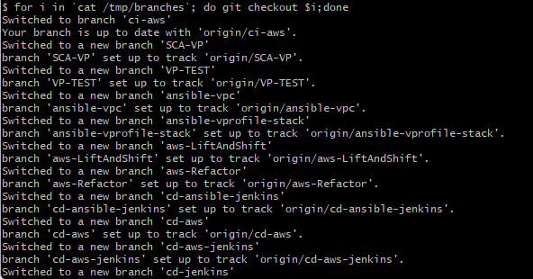

# Project-11: AWS CI/CD PROJECT

[*Project Source*](https://www.udemy.com/course/decodingdevops/learn/lecture/26466336#overview)

## Pre-requisites
 * AWS services

 

## Step-1: Create an Application on Elastic beanstalk
- Create an elastic beanstalk application with the properties below
```sh
Application name: vprofile
Tag: Name, vprofile
```

- Create an environment with the properties below:
```sh
Environment name: Vprofileapp-prod
Domain: vprofileprod7
Platform: Tomcat
keep the rest default
Configure more options:
- Custom configuration
****Capacity****
LoadBalanced
Min:2
Max:8
InstanceType: t2.micro
****Rolling updates and deployments****
Deployment policy: Rolling
Percentage :50 %
****Security****
EC2 key pair: vpro-bean-key
```

- PS: Domain needs to be unique & check the availability after choosing it.


## Step-2: Create RDS

- Now we will move toward RDS (Relational database service)
- After deployment our application should connect to RDS database and instance health should be healthy.
- Create RDS instance with below properties.

```sh
Method: Standard Create
Engine Options: MySQL
Engine version: 5.7.43
Templates: Free-Tier
DB Instance Identifier: vprofile-rds-prod
Master username: admin
Password: Auto generate psw
Instance Type: db.t3.micro
SecGrp:  vprofile-rds-prod-sg
No public access
DB Authentication: Password authentication
Additional Configuration
Initial DB Name: accounts
Keep the rest default or you may add as your own preference
```

- P.S: After clicking Create button, you will see a popup. Click View credential details and note down auto-generated db password. it will be used in the application config files.

- Update the RDS Instance Security group:
```sh
Allow port 3306 in security group from Beanstalk Security Group.
```


## Step-3: Connect to RDS
- SSH into Beanstalk instance and connect to RDS
```sh
ssh -i Downloads/vpro-bean-key.pem ec2-user@<PublicIp vprofile-prod>
```


- Connect to the instance, but first install mariadb
```sh
sudo -i
yum install mariadb -y
mysql -h <RDS ENDPOINT> -u admin -p<password> accounts
exit
```

- To deploy the sq file, we need git
- Install git, then clone the source code
```sh
yum install git -y
git clone https://github.com/devopshydclub/vprofile-project.git
ls
```


- Check for the cloned branch
```sh
cd vprofile-project/
git status
```


- Initialize the Database
```sh
ls
mysql -h <RDS ENDPOINT> -u admin -p<password> accounts < src/main/resources/db_backup.sql
```

- Make change to the target group health check.
- `Environments` --> `Configuration` --> `Edit Instance traffic and scaling`, select the processes and edit
```sh
path: /login
Stickness: Enable
```

Now our health check will change from healthy to severe as now we are monitoring the health on /login path that is not available now as we have not deployed our artifact until now


## Step-4: Build and Deploy Artifact

- Beanstalk and RDS is ready we also have tested it now time to setup CI /CD pipeline for it, first we will see code commit service thats where we will store our source code instead of using github.
- First, create a repo
```sh
Repository name: vprofile-code-repo
```

- Create an IAM user, create policy and attach it to the user.
```sh
Username: vprofile-code-admin

Policy
Policy editor: code commit
Manual Actions: All codecommit actions
Resources: Region
          Repository name
Policy name: vprofile-code-admin-repo-fullaccess
```

- Generate SSH public key using the below command
```sh
ssh-keygen.exe
/c/Users/YM/.ssh/vpro-codecommit_rsa
cd .ssh
ls
cat vpro-commit_rsa.pub
```

- Upload the public key to the IAM user created earlier (vprofile-code-admin)


- Create a SSH Configuration file
```sh
vim config file

Host git-codecommit.*.amazonaws.com
  User <SSH KEY ID >
  IdentitfyFile ~/.ssh/vpro-codecommit_rsa
```

- Make the file executable and test with the credentials using commands below
```sh
ls -l
chmod 600 config
ssh git-codecommit.us-west-2.amazonaws.com
```


- Clone repository to local system
- `CodeCommit` --> `vprofile-code-repo` --> `Cloneurl` and click on SSH
```sh
cd /tmp/
git clone ssh://git-codecommit.us-west-2.amazonaws.com/v1/repos/vprofile-code-repo
```


## Step-5: Transition Github repo to CodeCommit repo
- Transition the Github repo to code commit repo, but issue is this repo has address of Github as remote repo we have to change it to CodeCommit
```sh
cd /c
git clone https://github.com/devopshydclub/vprofile-project.git
cd vprofile-project/
ls
cat .git/config
```


- Now, transition the Github repo to code commit repo
- List all your branches and check out to the branch you want to push to code commit using below commands
```sh
git branch -a
git checkout master
```

- List all your branches excluding branches with HEAD and master, and send out all output to a temp file using below commands
```sh
git branch -a | grep -v HEAD | cut -d '/' -f3 | grep -v master
git branch -a | grep -v HEAD | cut -d '/' -f3 | grep -v master > /tmp/branches
```

- Check out to all branches using for Loop
```sh
for i in `cat /tmp/branches`; do echo $i;done
for i in `cat /tmp/branches`; do git checkout $i;done
```



- Remove the current repository (Github) and add CodeCommit repository
```sh
git remote rm origin 
git remote add origin codecommit url
cat .git/config
```

- Now push all changes
```sh
git push origin --all
```

P.S: All branches are now on CodeCommit repository


## Step-6: Build artifact from source code 
- Build artifact from this source code using code build service:
`Developers Tools` --> `CodeBuild` --> `Build projects`

```sh
Project name: vprofile-Build
Source provider: AWSCodeCommit
Repository: vprofile-code-repo
Branch: vp-rem
Environment: Managed image
Operating system: Ubuntu
Runtime: Standard
Image: Always use the latest image for this runtime version
Environment type: Linux
Service role: New service role
Role name: codebuild-vprofile-Build-service-role
Buildspec: Insert build commands
```


- Note: replace RDS password and endpoint as your own

- Now we upload the artifacts on Amazon s3


- Stream the logs on cloud watch


## Step-7: Build Job

- Build the job and then deploy on beanstalk:
- `Developers Tools` --> `CodeBuild` --> `Build projects`


- Integrate all services through pipeline code
- First create pipeline
```sh
Pipeline name: vprofile-cicdipipeline
Role name: AWSCodePipelineServiceRole-us-west-2-vprofile-cicd-pipeline
Source code: AWS CodeCommit
Repository name: vprofile-code-repo
Branch name: vp-rem
Build provider: AWSCodeBuild
Region:
Project name: vprofile-Build
Build Type: Single build
Deploy provider: AWS Elastic Beanstalk
```


- Login to this application with user admin_vp and same password to check it is properly communicating with RDS database


## Step-8: Clean up
- Delete all resources created for this project